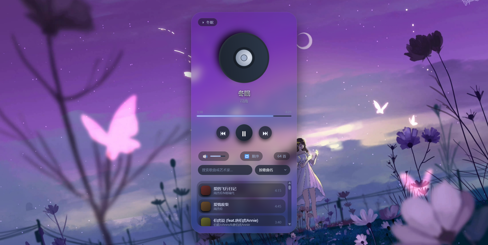

# 本地音乐播放器

一个轻量级本地音乐播放器，自动读取 `./resources/music/` 中的音乐文件，提供优雅的毛玻璃界面和丰富的播放功能。

## ✨ 特性
- 自动扫描本地音乐（支持 mp3、flac、wav 等常见格式）
- 播放控制（播放/暂停、上一首/下一首、顺序/单曲/随机模式）
- 音量调节（点击/拖动/滚轮）
- 实时搜索与排序（歌名/艺术家/时长，排序自动保存）
- 背景图片轮播（自动加载 `./resources/background/` 中的图片）
- 右键菜单：在歌曲上右键可“下一首播放”
- 毛玻璃界面 + 自定义滚动条

## 🚀 快速开始
1. **安装 Node.js**（≥12）
2. **下载项目**，进入目录
3. **安装依赖**：`npm install express`
4. **添加音乐**：将文件放入 `resources/music/`（可选背景图放入 `resources/background/`）
5. **启动服务**：`node server.js`或通过[start.pyw](./start.pyw)启动

## 📖 使用
- 左键点击歌曲播放
- 右键点击歌曲打开菜单（下一首播放）
- 搜索框实时过滤
- 下拉菜单排序
- 右下角音量条控制音量

## ⚙️ 自定义
- 修改轮播速度：编辑 `style.css` 中的 `animation: carousel 18s infinite;`
- 更改音乐/背景目录：修改 `server.js` 中的路径
